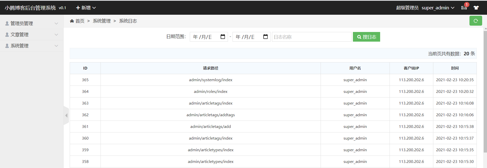
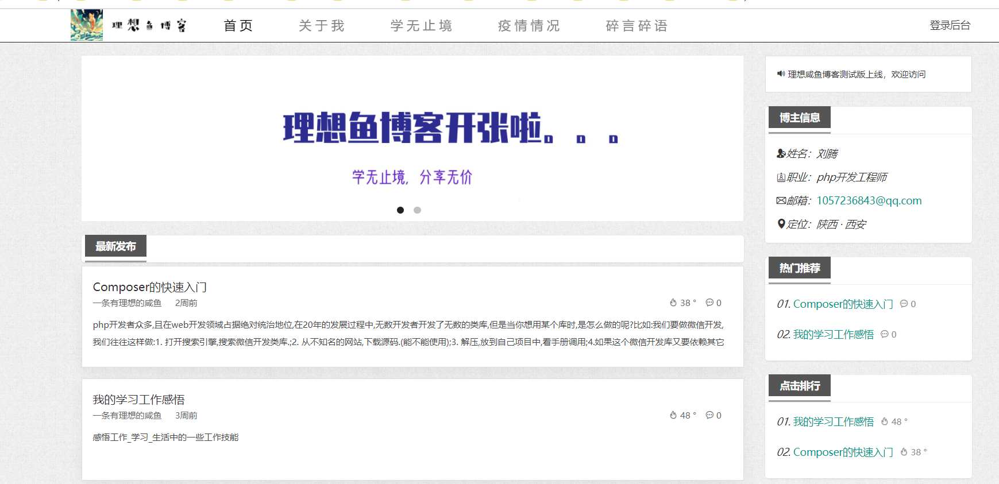

# thinkphp5_blog_system

## 系统介绍

本系统后端采用thinkphp5.1.41框架,前端采用h-ui模板框架

基于mvc模式开发的

后台管理系统

前台网站

演示地址 : https://blog.lt996.cn

## 系统开发/运行环境

### 开发环境

php7+mysql5.6+nginx1.5(建议采用phpstudy集成环境)

### 运行环境

php7+mysql5.6+nginx1.5+Linux7(建议采用宝塔面板集成环境)
